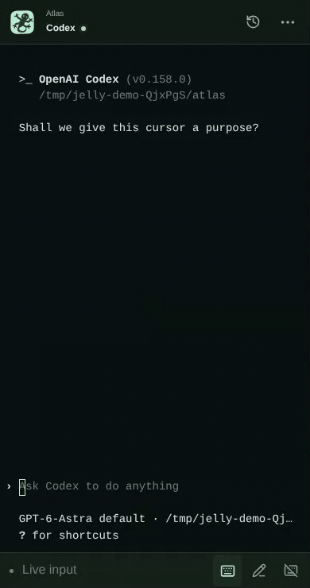

# Jelly

A web terminal for your own servers. Open a project on your phone or computer,
run Codex or Claude Code, and come back to the same session later.


[Desktop video](docs/media/jelly-demo.mp4) · [Mobile video](docs/media/mobile-codex.mp4) · [Codex and Claude Code examples](docs/GUIDE.md#codex-and-claude-code)

- **Persistent sessions.** Closing the tab or restarting Jelly keeps your shells running.
- **Local and SSH projects.** Remote servers only need SSH, a POSIX shell and tmux.
- **Phone-friendly input.** Touch scrolling, Unicode input and a floating keyboard for key combinations.

**Codex on mobile**

<a href="docs/media/mobile-codex.mp4"></a>

## Get started

Requires Linux, Node.js 24 and tmux 3.2+.

```bash
git clone https://github.com/jae-heo/jelly.git
cd jelly
npm ci
npm run build
npm start
```

Open [localhost:47821](http://127.0.0.1:47821), enter the connection key from
`.data/token`, and add a project folder.

For phone access, follow the [Tailscale setup](docs/SETUP.md#connect-from-another-device).

## Guides

- [Using Jelly](docs/GUIDE.md) — projects, sessions, input and shortcuts.
- [Setup and development](docs/SETUP.md) — remote access, SSH, configuration and tests.
- [API reference](docs/API.md) — HTTP and WebSocket.

[MIT](LICENSE) · Built with React, xterm.js, Node.js and tmux.
